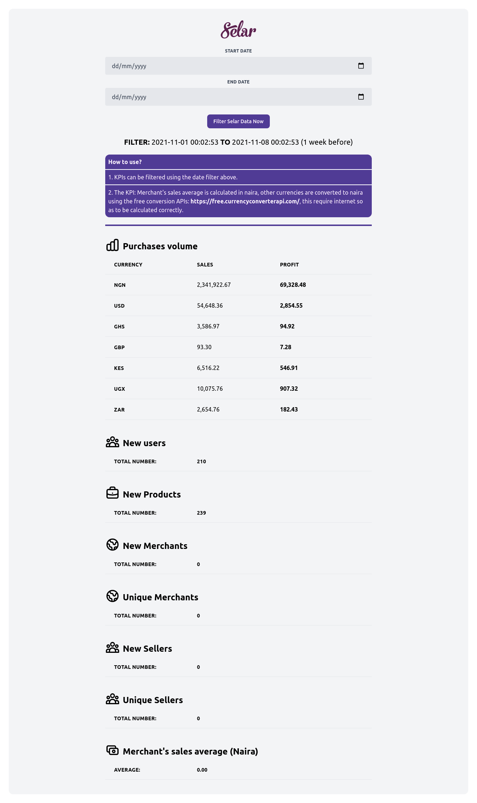

# selar-test
A short test for selar
## Technology
Built with Laravel
## Setup
- Link the database and configure the env file of the project.
- Run `php artisan serve`, then visit `http://127.0.0.1/`
- KPIs can be filtered using the date filter above.
- The KPI: Merchant's sales average is calculated in naira, other currencies are converted to naira using the free conversion APIs: https://free.currencyconverterapi.com/, this requires internet to be calculated correctly.
### Screenshot

